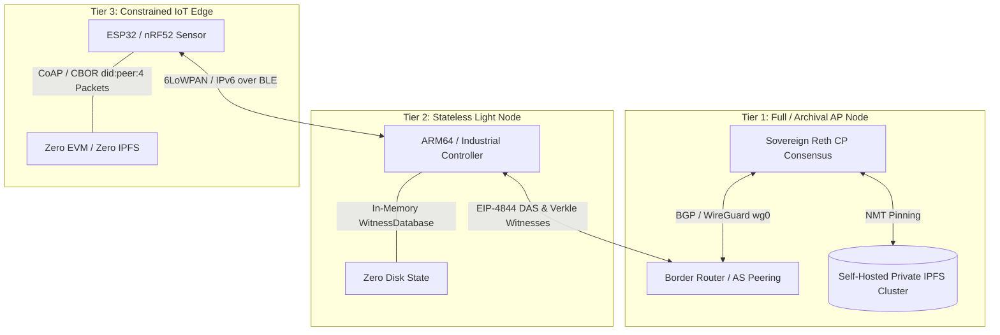

# Sovereign Reth: The Manifold Architecture

The **Consensus Database** of the Sovereignty‑Stack Manifold. 
Sovereign Reth is a pure‑stateless, witness‑executed sovereign Ethereum node utilizing Celestia-style DA, cross-manifold BGP routing, and Dual-Path Proof of Trust (DPoT).

**We are building a Manifold.** 

Forget the standard "Web3" and "L2 rollup sequencer" narratives. We are not interested in token selling. Our focus is purely on the technology: building a sovereign, robust, and mathematically sound infrastructure based on hardware-attested trust, stateless execution, and physical-layer routing.

---

## The Paradigm Shift

| Feature | Legacy IP + Ethereum | Our Sovereign Manifold |
|---------|----------------------|----------------------------|
| **Network Layer** | Public IP / DNS | **Raw Fiber + `did:peer:4` Cryptokey Routing (WireGuard)** |
| **Identity** | None (Added at App Layer) | **Unified cryptographic root (Zero-KMS)** |
| **State Footprint** | Bloated global MPT | **Stateless (WitnessDatabase) + IPFS Cluster** |
| **Hardware cost** | High-end server class | **$10 Embedded ARMv7 Board + secondhand SSD** |
| **Cross-Chain** | Insecure Multisig Bridges | **BGP-style Cross-Manifold Precompiles (`0xff`)** |

---

## Architecture & Vision

### 1. The Physical Layer & Network Peering (The Fiber/WireGuard Bridge)
We eliminate external DNS, ICANN registration, and public IP routing for node-to-node consensus entirely.
* **Cryptokey Peering:** Over physical fiber, connections are managed by a local WireGuard interface (`wg0`).
* **Zero-KMS (Single-Key Derivation):** On boot, the node derives all keys from a single seed:
  * *Layer 1/2:* Curve25519 key for WireGuard transport encryption.
  * *Layer 3/4:* Ed25519 key representing the `did:peer:4` offline document.
  * *Layer 5+:* `secp256k1` key for signing EVM blocks.
* **Zero-Config Handshake:** Operators simply trade `did:peer:4` URIs. The node automatically extracts the WireGuard public key, configures the secure tunnel, and whitelists the peer's EVM key.

### 2. Implicit State & The Execution Block
We abandon local state for validators entirely. 
The blockchain does not hold the state index. The state is represented strictly by a 32-byte State Root hash ($S_n$). The transition to $S_{n+1}$ is proven by applying a tiny State Diff ($\Delta$).
Peer nodes **do not run the EVM** to verify blocks. They apply the state diff directly to their local memory map and assert the new State Root is mathematically correct.

### 3. Gateway vs. Validator Split & The Witness Mempool
We split the network to protect user wallets from generating massive cryptographic witnesses:
* **Stateful RPC Gateway (`--node-type replica`):** Stores the flat state (backed by TiKV/CockroachDB), receives standard TXs, dry-runs them, generates the cryptographic `ExecutionWitness`, and gossips the `Transaction + Witness Bundle` to validators.
* **Stateless Validator Node (`--node-type validator`):** Executes transactions in-memory via `WitnessDatabase`. Checks memory limits (fits easily inside 2GB SGX EPC).
* **Witness-Enabled FCFS Mempool:** Transactions are First-Come-First-Serve. The validator mempool explicitly intercepts intents, verifies the attached witness mathematically against the *current* State Root, and instantly rejects stale/invalid txs.
* **Parallel EVM (Block-STM):** Mandatory EIP-2930 storage access keys allow the stateless validator to run parallel execution across non-conflicting threads natively with zero DB I/O latency.

### 4. Data Availability: Celestia Tricks (NMTs + DAS)
State availability is completely offloaded to a local IPFS/IPLD Cluster.
* **State as Git (IPLD DAGs):** State updates are saved as content-addressed IPLD blocks on IPFS. Deduplication ensures only changed state diffs consume physical disk space.
* **Namespaced Merkle Trees (NMTs):** Blocks are formatted as NMTs. Applications are assigned unique namespaces (e.g., `NS_02` for Nextcloud). Validators only download and verify state diffs for the namespaces they care about.
* **Data Availability Sampling (DAS):** Low-power edge devices act as DAS light nodes, randomly sampling 16 IPLD chunks (2D Reed-Solomon Erasure Coded) to verify block availability before signing consensus.

### 5. BGP-Style Based Meshing & Cross-Manifold Precompiles
We treat separate manifolds like Autonomous Systems (AS) in BGP internet routing, lowered into native EVM executions and non-interactive ZK proof verification:
* **The Cross-Manifold Precompile (`0xff`):** Cross-chain intents compile to a `STATICCALL` to precompile `0xff` (`CROSS_MANIFOLD_PRECOMPILE_ADDRESS`). Instead of interactive HTLC time-locks or rollback sagas, the precompile verifies a succinct universal recursive ZK validity proof (SP1, RiscZero, Groth16) in $O(1)$ constant time.
* **Programmable BGP Bandwidth SLAs:** Overlapping border routers act as Althea pay-per-forward relayers. When a ZK proof of SLA settlement is verified in precompile `0xff`, the node programmatically allocates UDP WireGuard tunnels (`wg0`) and advertises the new forwarding rates across its dynamic BGP routing table.

### 6. ZKP Federated Identity (Authentik + SIWE)
Replacing heavy DAO governance with a federated identity stack:
* **Off-Chain Directory:** Authentik manages user roles/groups off-chain.
* **Root Commitments:** A relay compiles the active user directory into a sparse Merkle tree and posts the 32-byte root hash on-chain.
* **Zero-Knowledge Proofs (ZKPs):** Users log in via SIWE, generate a local ZKP (e.g., groth16 or SP1) proving their credential exists under the root commitment, and execute transactions without storing personal data on-chain.

### 7. The Dual-Path Admission Layer & Slashing Engine
The entry ticket to the block-building validator pool bypasses Proof of Stake.
* **Path A: TEE Automatic Registration (Zero-Trust):** Embeds an ephemeral public key in hardware quotes (SGX/TDX/SEV-SNP). Includes explicit DEBUG rejections to prevent exploits.
* **Path B: Vanilla Social Registration (Proof of Reputation):** Operator signs a delegation payload using an offline `did:peer:4` master key. Peers resolve it locally against a TinyMeritRank threshold.
* **The Slashing Engine:** An $O(1)$ memory operation evicts bad actors from the `AllowedSequencers` registry with dynamic TinyMeritRank decay (e.g., Equivocation = Full eviction).

---

## Hardware Operational Tiers & Deployment Modes

The Sovereign Stack is architected to scale seamlessly from enterprise server racks down to battery-powered Bluetooth microcontrollers across a unified horizontal BGP mesh:



### 🖥️ Tier 1: Full / Archival AP Mode (Core Border Router)
Designed for enterprise gateways, AS border routers, and permanent data availability archives.
* **Real-Time CP Consensus + Asynchronous AP Recovery:** Runs full EVM consensus at 12-second slot speeds. Before ephemeral EIP-4844 / PeerDAS blobs expire (~18 days), the attached `RpcIpfsArchivalDaemon` partitions state diffs into Namespaced Merkle Trees (NMTs) and permanently pins them to a self-hosted private IPFS/Kubo cluster.
* **BGP & Bandwidth SLA Settlement:** Inspects multi-hop `BasedMeshPacket` payloads, verifies ZK proofs via Precompile `0xff`, and dynamically manages physical `wg0` WireGuard bandwidth routing tables.
* **Requirements:** 4+ CPU Cores, 12GB+ RAM, NVMe SSD, Docker / local IPFS Kubo daemon.

### 🥧 Tier 2: Stateless Light Mode (Embedded ARM64 / Edge Controller)
Designed for embedded gateways, Raspberry Pi 4/5, automated drones, and industrial manufacturing machinery.
* **Pure Stateless Consumer:** **Zero state database required.** Executes EVM transactions strictly in-memory via `WitnessDatabase` by consuming EIP-6800 Verkle Tree execution witnesses and sampling EIP-7594 PeerDAS blobs.
* **Edge Routing Bridge:** Acts as the local WireGuard (`wg0`) termination point for surrounding constrained IoT sensors, translating sensor telemetrics into BGP-gossiped `BasedMeshPacket` intents.
* **Requirements:** ARMv7 / ARM64 / x86_64, 512MB–2GB RAM (SGX EPC compatible), standard SD card or flash memory.

### 🔋 Tier 3: Constrained Edge Mode (6LoWPAN / IPv6 over BLE)
Designed for ultra-low-power microcontrollers (ESP32-C3/S3, Nordic nRF52/nRF53, environmental sensors, smart meters).
* **Zero EVM / Zero IPFS Footprint:** The constrained device does **not** run the EVM, IPFS, or a Linux WireGuard kernel module.
* **6LoWPAN & IPv6 over BLE Transport:** Communicates over IEEE 802.15.4 (6LoWPAN) or Bluetooth Low Energy (BLE) using compressed CoAP / CBOR packets.
* **`did:peer:4` Cryptographic Signatures:** The microcontroller derives a lightweight Ed25519/Curve25519 keypair from hardware fuses, signs raw intent payloads (e.g., temperature telemetry, power grid usage, or Althea micro-payment vouchers), and transmits them to a Tier 2 Light Node or Tier 1 Gateway over IPv6 link-local radio.

---

## Crate Topology

```text
sovereign-reth/
├── Cargo.toml                 # Includes SP1/groth16 ZKP deps & paradigmxyz/stateless
└── crates/
    ├── node/                  # Custom Reth Node Builder & CLI (--node-type replica|validator)
    ├── consensus/             # The Hybrid Consensus & Validation Engine
    │   ├── src/
    │   │   ├── stateless.rs   # Implements WitnessDatabase validation & Block-STM integration
    │   │   ├── nmt.rs         # Celestia-style Namespaced Merkle Tree hasher
    │   │   ├── based_mesh.rs  # EIP-4844 Block-in-Blob & universal recursive ZK proof wrappers
    │   │   ├── archival.rs    # RpcIpfsArchivalDaemon & local IPFS cluster pinning backend
    │   │   ├── registry.rs    # Unified TEE and did:peer:4 validator directory
    │   │   ├── bgp.rs         # BGP WireGuard router & dynamic SLA forwarding table
    │   │   ├── precompile.rs  # Cross-Manifold Precompiles (`0xff`, `0xfe`, `0xfd`)
    │   │   └── slashing.rs    # ReputationSlash handler, TinyMeritRank decay & auto-eviction
    ├── attestation/           # Hardware quote generation utility
    │   ├── src/
    │   │   ├── sgx.rs         # /dev/sgx_enclave via Gramine
    │   │   └── mock.rs        # Mock provider for Vanilla nodes
    ├── identity/              # did:peer:4, PoR Resolver, and ZKP Auth
    │   ├── src/
    │   │   ├── delegation.rs  # Session-key authorization checks
    │   │   ├── merit.rs       # Interfaces local TiKV/MDBX TinyMeritRank
    │   │   └── zkp_auth.rs    # SIWE/Authentik ZKP verification logic
    └── network/               # Physical Layer & Peering
        ├── src/
            ├── wireguard.rs   # wg0 interface management
            ├── handshake.rs   # Single-Key derivation & Zero-Config peering
            └── bgp_gossip.rs  # Overlapping validator cross-manifold routing queues
```

---

## Getting Started

This repository is designed so you can pull it, build it, and it just works.

### Prerequisites

You must have Rust (with `clang` and `libclang-dev`) and Node.js installed. If you plan to cross-compile for embedded ARM (Tier 2) or RISC-V targets, you also need to install the cross-compiler toolchains:

```bash
# Core prerequisites
sudo apt-get update && sudo apt-get install -y clang libclang-dev nodejs

# Cross-compilation linkers (optional, for ARM/RISC-V targets)
sudo apt-get install -y gcc-aarch64-linux-gnu gcc-riscv64-linux-gnu
```

### 1. Compile Smart Contracts
The custom paymaster contract must be compiled to generate the runtime bytecode:

```bash
cd contracts
npm install
node compile.js
cd ..
```

### 2. Generate Genesis Configuration
Generate the `genesis.json` configuration file, pre-allocating state for the EntryPoint and the compiled paymaster contract:

```bash
node build_genesis.js
```

### 3. Compiling the Node

To compile the node, we provide a unified `build.sh` script that automatically optimizes the compiler memory footprint to prevent WSL OOM issues and system hangs. It does this by:
1. **Restricting concurrency**: Forcing single-process execution (`-j 1` / `jobs = 1`) to avoid multi-process RAM explosions.
2. **Capping compiler memory**: Running a compiler wrapper script (`scripts/rustc-limit-wrapper.sh`) that sets a 2.5 GB virtual memory limit (`ulimit -v`) for each `rustc` invocation.
3. **Splitting LLVM work**: Specifying `codegen-units=16` in `RUSTFLAGS` (rather than 1) which splits the huge crates into smaller modules, dramatically reducing peak LLVM RAM usage.
4. **Optimizing the Linker**: Configures the `gold` linker (`-fuse-ld=gold`) with memory-saving options (`-Wl,--no-keep-memory`, `-Wl,--reduce-memory-overheads`, `-Wl,--hash-size=31`) to prevent OOMs during the heavy binary linking phase.
5. **Limiting `sccache` resource usage**: Starts `sccache` daemon with a 1.5 GB virtual memory limit, sets a maximum cache limit of 5 GB (`SCCACHE_CACHE_SIZE=5G`), and configures a 60-second idle timeout (`SCCACHE_IDLE_TIMEOUT=60`) to automatically shutdown compiler daemons and free system memory.

#### A. Compile for the Local Host (Default)
By default, the script compiles for your host target and automatically initializes the storage database in `db/`:
```bash
./build.sh
```

#### B. Reclaiming Disk Storage (Clean Target)
If storage is running low or you want to clear target artifacts and stop compiler daemons:
```bash
./build.sh --clean
```
This stops the `sccache` server, cleans the Cargo workspace, and removes the `db/` directories and compiler caches.

#### C. Cross-Compiling for Specific Hardware Targets
You can specify the target architecture using the `--target` option. The script will automatically verify the required cross-compilation compiler is installed:
* **Intel/AMD x86_64:** `./build.sh --target x86` (compiles to target `x86_64-unknown-linux-gnu` and initializes `db/`)
* **ARM64 (Raspberry Pi 4/5, Tier 2 Embedded):** `./build.sh --target ARM` (compiles to target `aarch64-unknown-linux-gnu`)
* **RISC-V (Embedded/IoT):** `./build.sh --target RISC-V` (compiles to target `riscv64gc-unknown-linux-gnu`)
* **Build All Targets:** `./build.sh --target ALL`

*Note: Cross-compiled target builds automatically skip the database initialization stage since they cannot be executed natively on the host.*

---

### 4. Running the Node & Network Simulation

#### A. Run a Single Node Dev Server (Auto-Mining Mode)
To run a local standalone node for debugging that automatically mines blocks as transactions arrive:
```bash
./target/release/sovereign-reth node \
  --dev \
  --chain genesis.json \
  --datadir db \
  --http --http.api all --http.corsdomain "*"
```
In this mode, P2P network discovery is disabled and the node operates in solitary testing mode.

#### B. Run Local Peer-to-Peer Simulation Network (E2E Transaction Testing)
To simulate a multi-node peering network locally on a single host (e.g. to test transaction propagation and synchronization), we provide a `peer_test.sh` script:
```bash
./peer_test.sh
```
This script:
1. Resets database folders and starts **Node 1 (Validator/Auto-Miner)** on HTTP port `8545` and P2P port `30303`.
2. Resolves Node 1's `enode` address.
3. Starts **Node 2 (Replica)** on HTTP port `8546` and P2P port `30304`, connecting it to Node 1 via `--bootnodes`.
4. Keeps both nodes running so you can send transactions to either node and verify that they propagate, get mined, and sync.

#### C. Run a Stateful RPC Gateway (Production/Replica Mode)
The Gateway acts as the RPC provider for wallets. It stores the flat state, dry-runs transactions, and generates cryptographic execution witnesses.
```bash
./target/release/sovereign-reth node \
  --node-type replica \
  --chain genesis.json \
  --datadir db \
  --http --http.api all --http.corsdomain "*"
```

#### D. Run a Stateless Validator (Vanilla/ARMv7)
The pure in-memory executor. No state database is required. It verifies witnesses, applies state diffs, and pushes data to IPFS.
```bash
./target/release/sovereign-reth node \
  --node-type validator \
  --chain genesis.json \
  --tee none \
  --did-peer4 "did:peer:4zQmd..." \
  --delegation-proof ./delegation.sig \
  --merit-threshold 0.05
```

#### E. Run a Stateless Validator (SGX Enclave via Gramine)
Because the validator is stateless, the entire execution environment easily fits inside a 2GB SGX EPC cache without paging.
```bash
# Build and sign the Gramine manifest
cd gramine
./build.sh

# Launch the node securely inside the enclave
gramine-sgx sovereign-reth node \
  --node-type validator \
  --chain ../genesis.json \
  --tee sgx \
  --approved-mrenclave 0x...
```
