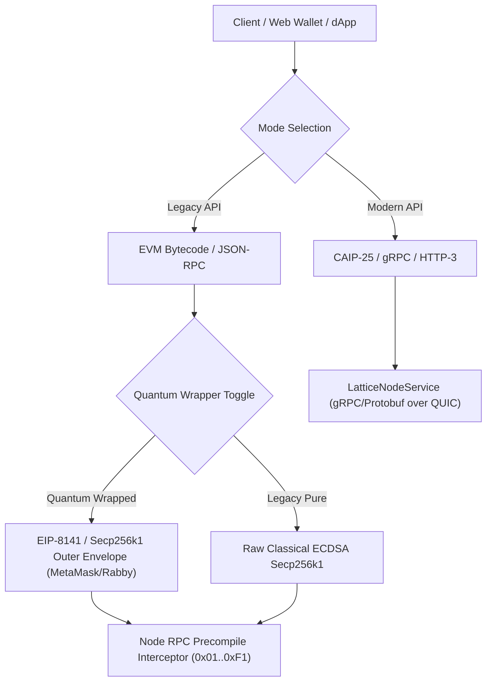

# Sovereign Multi-Tier API & Transport Matrix

This document defines the dual-mode API surface and multi-transport interface of the Sovereign Reth Account-Lattice.

## 1. Protocol Tiers Overview

---

## 2. API Transport Modes

### Tier 1: Legacy API (`dApp Mode`)
- **Transport**: Standard HTTP/1.1 or HTTP/2 JSON-RPC over EIP-1193 (`window.ethereum` / `window.rabby`).
- **Target**: Low-entropy precompile contracts (`0x00...0001` to `0x00...0100`).
- **Method**: Standard EVM ABI function calls dispatched via `eth_sendTransaction` or `eth_call`.
- **Quantum Wrapping**:
  - **Active**: Inner state transitions signed with ML-DSA-65 / Falcon-512 are encapsulated in an EIP-8141 multi-frame payload signed by classical Secp256k1 ECDSA. Legacy hardware wallets (Ledger, Trezor) and browser extensions sign the outer envelope without protocol failure.
  - **Inactive (Pure Classical)**: Classical ECDSA transactions are submitted directly without post-quantum signature fields.

### Tier 2: Modern API (`CAIP-25 / gRPC / HTTP-3`)
- **Transport**: gRPC over HTTP/3 (QUIC) and CBOR binary wire format.
- **Specification**: [`specs/proto/sovereign.proto`](../specs/proto/sovereign.proto).
- **Quantum Execution**: 100% Native. The `StatelessTransitionFrame` is transmitted directly with native post-quantum signatures and UltraHonk SNARK witnesses. No outer Secp256k1 wrapping envelope is needed.
- **Bandwidth**: ~70% lower packet overhead compared to JSON-RPC over TCP.

---

## 3. Precompile Bytecode Routing Matrix

| Address | Interface | Function Signature | Description |
|---|---|---|---|
| `0x00...0001` | `IRegisterRouter` | `mountSlot(uint8,string,bytes32)` | Mount polymorphic slot |
| `0x00...0002` | `IReceiveHook` | `sweepTransfer(address)` | Receive value & advance lattice tip |
| `0x00...0003` | `IDidRegistry` | `registerDid(string,bytes,string)` | Register W3C DID & PQ multibase keys |
| `0x00...0004` | `ISagaIntentRouter`| `registerIntent(bytes32,address,uint256,uint64)` | 2-Phase async intent escrow |
| `0x00...0005` | `IJurisdiction` | `setQuadrantBits(uint8,uint64)` | SMT compliance quadrant declaration |
| `0x00...0006` | `IBridgeShadow` | `anchorShadowReceipt(bytes32,address,address,uint256,bytes)` | Cross-chain shadow anchor |
| `0x00...0007` | `IAsyncInbox` | `dispatchAsync(address,bytes)` | Inter-account async mailbox |
| `0x00...0008` | `IZkCompliance` | `submitComplianceTicket(bytes,bytes32)` | Stateless UltraHonk compliance check |
| `0x00...0053` | `IStorageDA` | `verifyStoragePor(bytes,uint32,bytes)` | Bao outboard tree & ZK-PoR |
| `0x00...0054` | `ISignalRegistry` | `inscribeSignal(address,bytes32,bytes)` | Blinded interest in Cuckoo filter |
| `0x00...0061` | `IZanzibarReBAC` | `check(uint16,bytes32,uint16,address)` | In-memory Zanzibar ReBAC authorization |
| `0x00...00F1` | `IActivityPubCMS` | `publishActivity(bytes)` | W3C ActivityStreams 2.0 note anchor |
| `0x00...0100` | `ILatticeHeight` | `getAccountHeight(address)` | Local block lattice sequence height |
