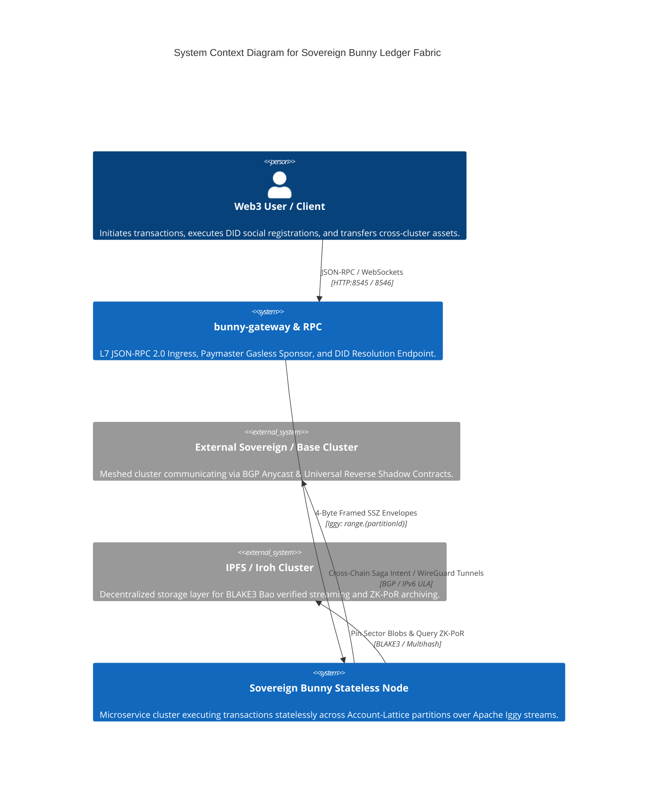
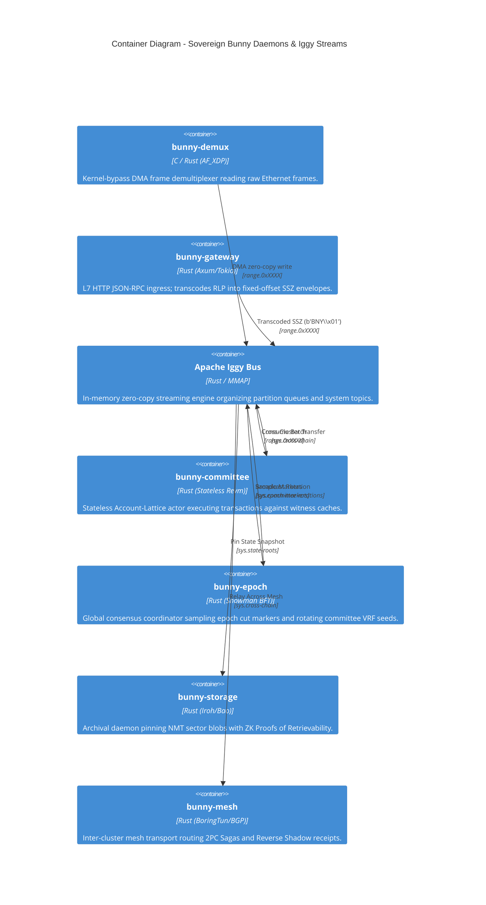
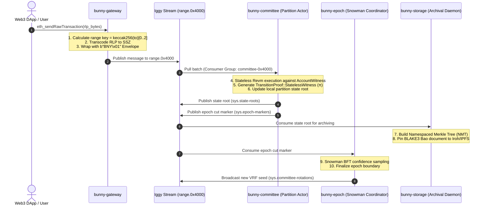
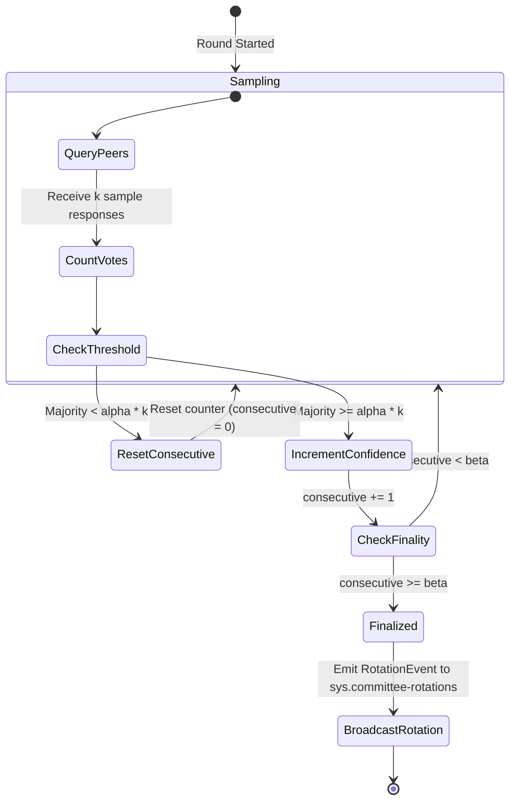
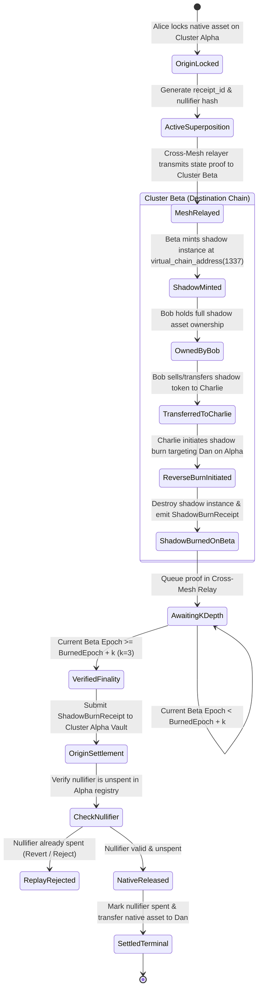

# Sovereign Bunny Cluster Architecture & State Dynamics

This document specifies the multi-tiered **C4 Model Architecture**, **Message Flow Sequences**, and **Statecharts (FSMs)** governing the stateless microservice daemons of the Sovereign Bunny Ledger.

---

## 1. C4 Model Architecture

### Level 1: System Context Diagram
Shows how external users, Web3 dApps, and peer clusters interact with the Sovereign Bunny node fabric.

---

### Level 2: Container Diagram (Microservice Daemons & Streams)
Illustrates the decomposition of `bunny` into isolated microservice daemons connected strictly via **Apache Iggy message topics**.

---

## 2. Event-Driven Message Flow Sequences

### End-to-End Stateless Transaction Lifecycle
Demonstrates the zero-shared-memory execution flow from ingress to storage archival.

---

## 3. Statecharts & Deterministic FSMs

### A. Snowman BFT Meta-Consensus FSM ([`crates/consensus/src/engine/snow.rs`](../../crates/consensus/src/engine/snow.rs))
Governs probabilistic confidence accumulation across committee partition markers.

---

### B. Universal Reverse Shadow Contract Cross-Cluster 2PC Lifecycle ([`crates/consensus/src/system_contracts/shadow_contract.rs`](../../crates/consensus/src/system_contracts/shadow_contract.rs))
Governs two-way asset superposition, ownership transfers on destination chains, reverse burns, and $k$-epoch reorg protection.

---

## 4. Single Responsibility Summary Matrix

| Daemon | Binary Subcommand | Primary Inbox (Iggy) | Outbox Topics | Primary Concern |
|---|---|---|---|---|
| **Gateway** | `bunny daemon gateway` | Network JSON-RPC (HTTP) | `range.{partitionId}` | L7 ingress, RLP $\to$ SSZ transcoding, Paymaster gasless intent sponsorship. |
| **Committee** | `bunny daemon committee` | `range.{partitionId}` | `sys.state-roots`, `sys.epoch-markers` | Stateless Revm execution over ephemeral witness caches. |
| **Epoch** | `bunny daemon epoch` | `sys.epoch-markers` | `sys.committee-rotations` | Snowman BFT consensus, global epoch cuts, and VRF validator rotation. |
| **Storage** | `bunny daemon storage` | `sys.state-roots` | `sys.storage-partition` | NMT sector partitioning, IPFS/Iroh pinning, BLAKE3 Bao ZK-PoR proofs. |
| **Mesh** | `bunny daemon mesh` | `sys.cross-chain` | Remote BGP peers | Inter-cluster BGP Anycast routing, WireGuard encryption, Reverse Shadow relay. |
| **Identity** | `bunny daemon identity` | Local RPC / P2P | Local Resolver Cache | Multi-curve W3C DID document & `.bunny` social namespace resolution. |
| **Enclave** | `bunny daemon enclave` | Hardware Mailbox | `sys.state-roots` | SGXv2/TDX Gramine hardware-isolated confidential VM execution. |
| **RPC Proxy** | `bunny daemon rpc` | HTTP :8546 | Upstream Node | 48-hour hot state cache and synthetic receipt generation. |
